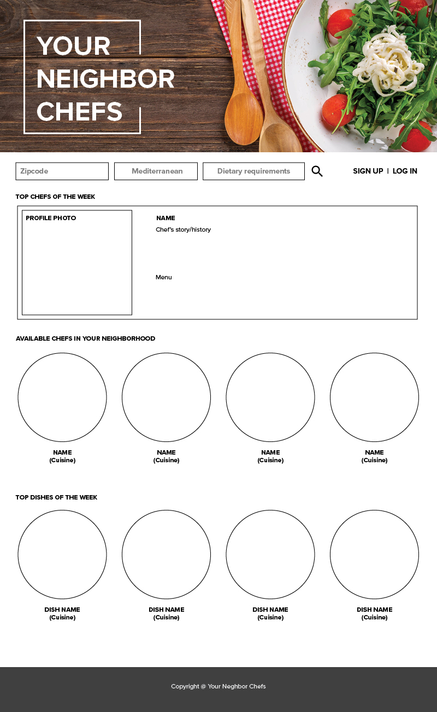
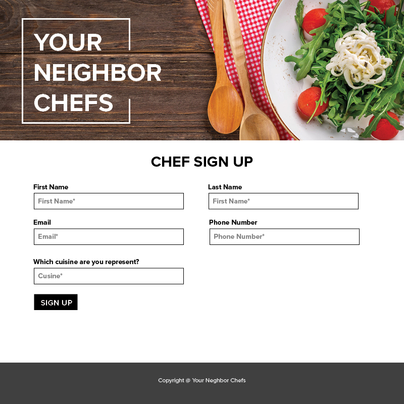
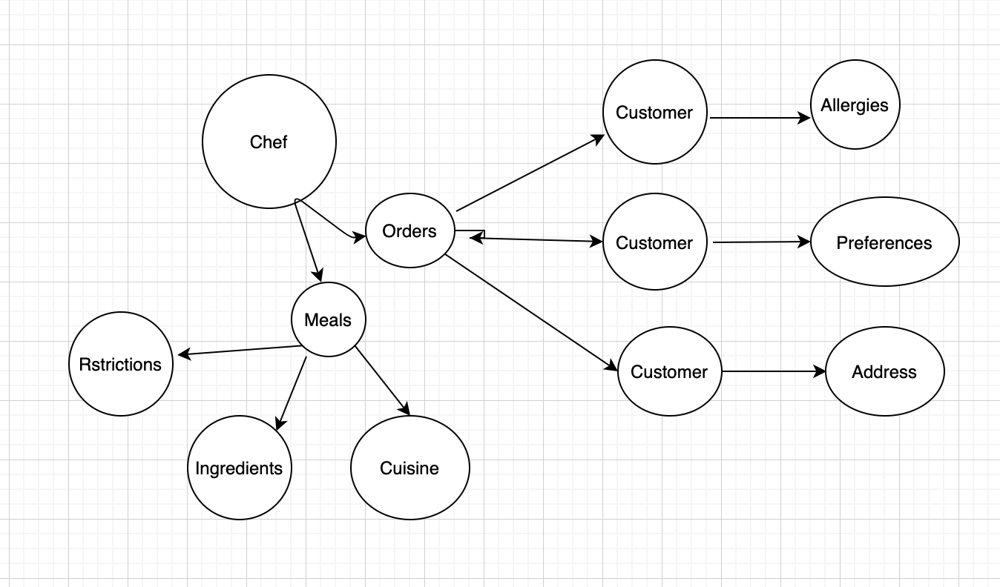

# Project-2
A meal sharing application that allows users to sign up either as a chef or as a foodie. Meals are posted by chefs only and orders are posted by customers based on existing meals.

# Objective
* Users can sign up as chefs and post their menus of specific cusines (American, Thai, Indian, etc.), each menu may include special items that would accommodate dietary needs (vegan, gluten-free, dairy free, etc.)
* Other users can sign up as foodies and set up their profiles with dietary preferences

# User Story:
```md
AS A Stay at Home Chef
I WANT to create meals and post them on the website and store it in a Database
SO THAT Customers(Users) can look up all meal options based on certain specifications(Cuisine, Restrictions, Proximity/Time takes to deliver a meal)
```

```md
Its done when the "/" homepage route renders the following(Top Chef of the week, Chefs in the area, Meals)
Its done when the "/signUp/chef" page route renders a form where a new user can register as a chef
Its done when the "/signUp/foodie" page route renders a form where a new user can register as a customer(foodie)
Its done when the "/chef-profile" page route renders a page with a given chef information(Name, Contact Info, Location, Rating, Specialty)
Its done when the "/meals/:id" page route renders a page with a all meals for a given chef specified in ":id"
Its done when the "/orders/:customer_id/:meal_id" page route renders a page with all placed orders for a given customer for a given meal
```






